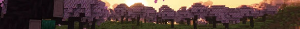

<h1 align="center">
     
    
     
</h1>

- Repositorio hosteado con [GitHub Pages](https://pages.github.com/) utilizando [Sphinx](https://www.sphinx-doc.org/) con el tema [RTD](https://sphinx-rtd-theme.readthedocs.io/).
  - El sitio se encuentra en **[ahhfranz.github.io/ServidorMC/](https://ahhfranz.github.io/ServidorMC/)**
- En este repositorio vas a poder encontrar las últimas **novedades**, **actualizaciones** y **guías** para el servidor de Minecraft de la comunidad.

## Aviso
- Todos los enlaces utilizados son seguros, ninguno infringe términos y condiciones ni contienen copyright de ningún tipo.
  - Las guías y procesos de instalación están enfocados estrictamente en el servidor de la comunidad, no brindamos soporte a ningún otro servidor.

## Plugins más utilizados
<table align="center">
  <tbody>
    <tr>
      <td align="center">
 MCMMO
</td>
      <td align="center">
 Citizens
</td>
    </tr>
    <tr>
      <td align="center">
 PlotSquared
</td>
      <td align="center">
 Multiverse
</td>
    </tr>
    <tr>
      <td align="center">
 Ultra Permissions
</td>
      <td align="center">
 Decent Holograms
</td>
    </tr>
  </tbody>
</table>
